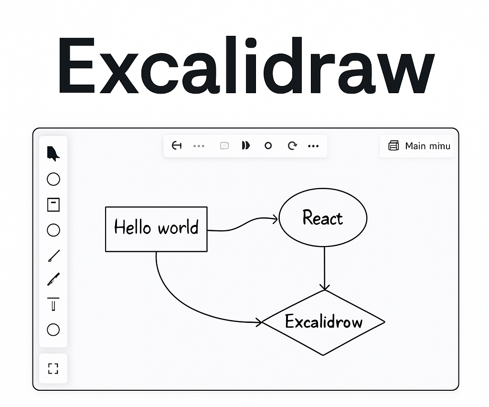

# Excalidraw Integration with React + Vite



This project demonstrates how to use [Excalidraw](https://github.com/excalidraw/excalidraw) in a React + Vite environment with hot module replacement and minimal configuration.

## Features

- 🖌️ Excalidraw whiteboard integration
- ⚡ Lightning-fast development with Vite
- ♻️ Hot Module Replacement (HMR)
- ✅ ESLint setup for code quality

---

## 🛠️ Getting Started

### Prerequisites

- Node.js ≥ 14
- npm or pnpm or yarn

### Installation

1. **Clone the repository:**

   ```bash
   git clone https://github.com/yourusername/excalidraw-vite-app.git
   cd excalidraw-vite-app

2. **Install Dependencies**
   ```bash
   npm install

3. **Run the development server**
   ```bash
   npm run dev

4. **Open in browser**  http://localhost:5173


5. **🧩 Excalidraw Usage**
   ```bash
   import { Excalidraw } from '@excalidraw/excalidraw';

   function Whiteboard() {
     return (
         <div style={{ height: '100vh' }}>
            <Excalidraw />
         </div>
      );
   }

   export default Whiteboard;

6. **📦 Make sure you have @excalidraw/excalidraw installed:**
   ```bash
   npm install @excalidraw/excalidraw

7. **📦 Build for Production**
   ```bash
   npm run build


## 🙌 Follow the Author

Made with ❤️ by **Muaaz Ahmad**  
GitHub: [@muaaz0333](https://github.com/muaaz0333)  
LinkedIn: [linkedin.com/in/MuaazAhmad](https://www.linkedin.com/in/expertfullstackdeveloper/)